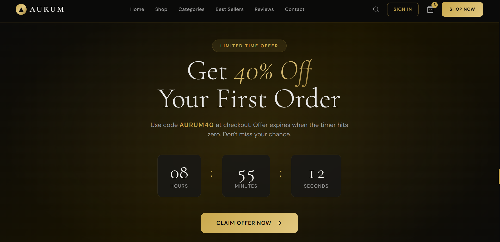
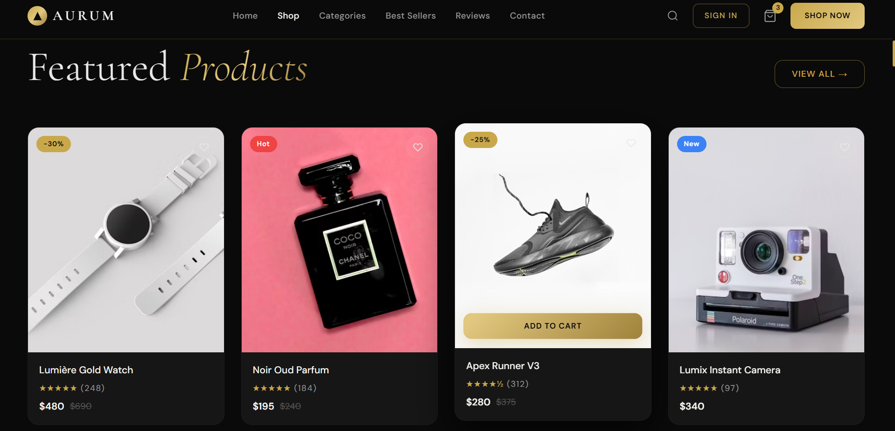
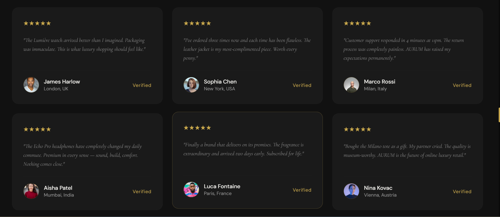
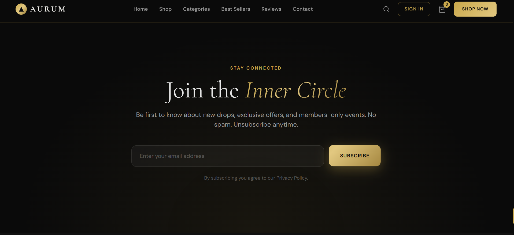
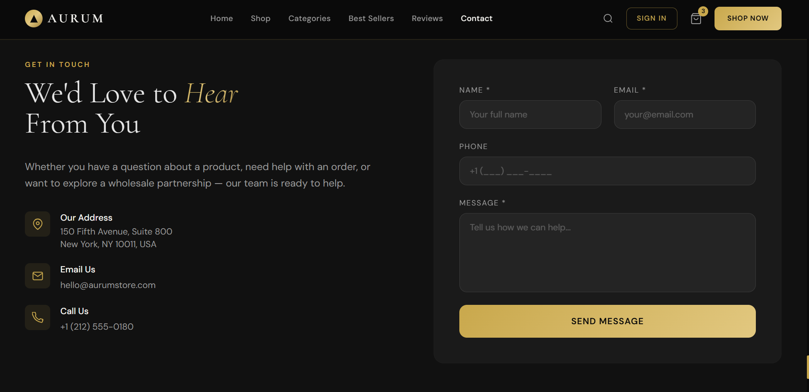

# AURUM — Premium Luxury Landing Page

AURUM is a modern, elegant, and fully responsive luxury brand landing page designed to showcase premium products and create a high-end digital experience.

The project combines luxury-inspired design, smooth animations, premium typography, and modern UI principles to deliver a visually engaging landing page suitable for fashion, lifestyle, jewelry, electronics, or luxury product brands.

---

## Preview

### Hero Section


### Featured Products


### Testimonials


### Newsletter Section


### Contact Section


---

## Project Overview

AURUM was created as a premium front-end landing page that focuses on:

- Luxury visual aesthetics
- Elegant typography
- Responsive design
- Smooth user experience
- Modern animations
- High conversion-focused layout

The design follows a dark luxury theme with gold accents to create a sophisticated and premium brand identity.

---

## Features

### Modern Luxury Design
- Premium dark theme
- Gold gradient accents
- Elegant visual hierarchy
- High-end branding style

### Fully Responsive
- Desktop friendly
- Tablet optimized
- Mobile responsive
- Flexible layouts

### Interactive Components
- Animated navigation bar
- Mobile menu
- Product cards
- FAQ accordion
- Wishlist interactions
- Smooth scrolling

### Advanced UI Effects
- Glassmorphism elements
- Hover animations
- Reveal-on-scroll animations
- Floating effects
- Shimmer effects
- Gradient text styling

### Marketing Sections
- Hero section
- Featured products showcase
- Categories section
- Statistics counters
- Testimonials
- Newsletter subscription
- Contact form
- FAQ section

---

## Technologies Used

| Technology | Purpose |
|------------|----------|
| HTML5 | Structure |
| Tailwind CSS | Styling |
| JavaScript | Interactivity |
| Google Fonts | Typography |
| CSS Animations | Visual Effects |

---

## Project Structure

```text
aurum-luxury-landing-page/
│
├── index.html
│
├── assets/
│   ├── hero-countdown.png
│   ├── featured-products.png
│   ├── testimonials.png
│   ├── newsletter.png
│   └── contact-us.png
│
└── README.md
```

---

## Design Highlights

### Color Palette

| Color | Usage |
|---------|---------|
| Gold (#C9A84C) | Primary Accent |
| Dark Black (#0A0A0A) | Background |
| Luxury White (#F5F4F0) | Text |
| Gold Light (#E2C880) | Highlights |

### Typography

- Cormorant Garamond
- DM Sans

These fonts create a luxury and editorial-style appearance that aligns with premium brands.

---

## Getting Started

### Clone Repository

```bash
git clone https://github.com/your-username/aurum-luxury-landing-page.git
```

### Open Project

Simply open:

```text
index.html
```

in your browser.

No installation or build process is required.

---

## Use Cases

This landing page can be adapted for:

- Luxury Fashion Brands
- Jewelry Stores
- Premium Electronics
- Lifestyle Products
- Watches & Accessories
- High-End E-commerce Stores
- Personal Luxury Brands

---

## Performance

- Lightweight structure
- Fast loading
- Responsive layout
- SEO-friendly HTML
- Optimized user experience

---

## Future Improvements

Potential enhancements include:

- Shopping cart integration
- Product filtering
- Backend integration
- Authentication system
- Payment gateway
- CMS support
- Dark/Light mode switcher

---

## Author

**Muhammad Husnain Raheem**

Aspiring Data Scientist | Data Analyst | Front-End Developer

GitHub:
https://github.com/Nain-007sh

---

## License

This project is available for educational and portfolio purposes.

Feel free to use, modify, and customize it for your own projects.

---

### Crafted with attention to detail, luxury aesthetics, and modern web design principles.
